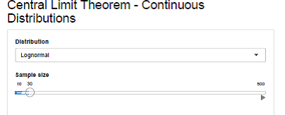
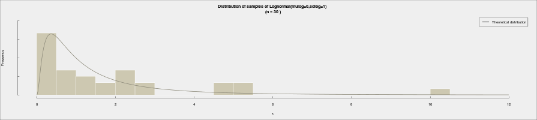
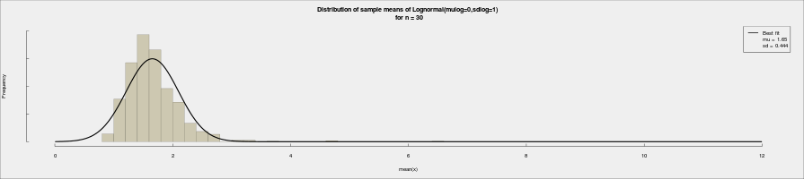

---
title       : Central Limit Theorem using Shiny 
subtitle    : Coursera's Developing Data Products
author      : Nishant Upadhyay
framework   : io2012     # {io2012, html5slides, shower, dzslides, ...}
highlighter : highlight.js  # {highlight.js, prettify, highlight}
hitheme     : tommorrow       # 
widgets     : []            # {mathjax, quiz, bootstrap}
mode        : standalone # {standalone, draft}
knit        : slidify::knit2slides
--- bg:lightyellow

## Introduction

This shiny pitch is intended to display the Central Limit Theorem (CLT) in the Coursera's Developing Data Products module.

My Approach to App creation:

_CLT basically says that the sampling distribution of the parent distribution will be tending towards normality irrespective of the population(parent) distribution as the sample size increases_

Building on this idea i have considered many differnt types of probability distributions namely:
  * Beta,Chi.squared,Exponential,F,Gamma,Lognormal,Normal,t,Uniform,Weibull)
  
I will taking the sampling distributions of the means to demonstrate CLT

--- .class #id bg:lightyellow

## The Application

The purpose of this app is to simulate data and test the central limit theorem. To do that, you only need to follow the following steps:

  1. Choose one of the Eleven kinds of predefined population distributions;
  2. Specify a sample size on the slider ranging from 10 to 500 in steps of 10;
  3. Voila!---You can see the parent distribution as well as the sampling distribution displayed on the right panel.

--- .class #id bg:lightyellow

## Demo Screen shot of the app

The data selection (Probability distribution & sample size)

--- .class #id bg:lightyellow

## The plots on the App 
(On the right side panel)

--- .class #id bg:lightyellow

The app was hosted at shinyapps.io which can be accessed here

[CLT_Shiny](https://nishantsbi.shinyapps.io/CLT_Shiny)